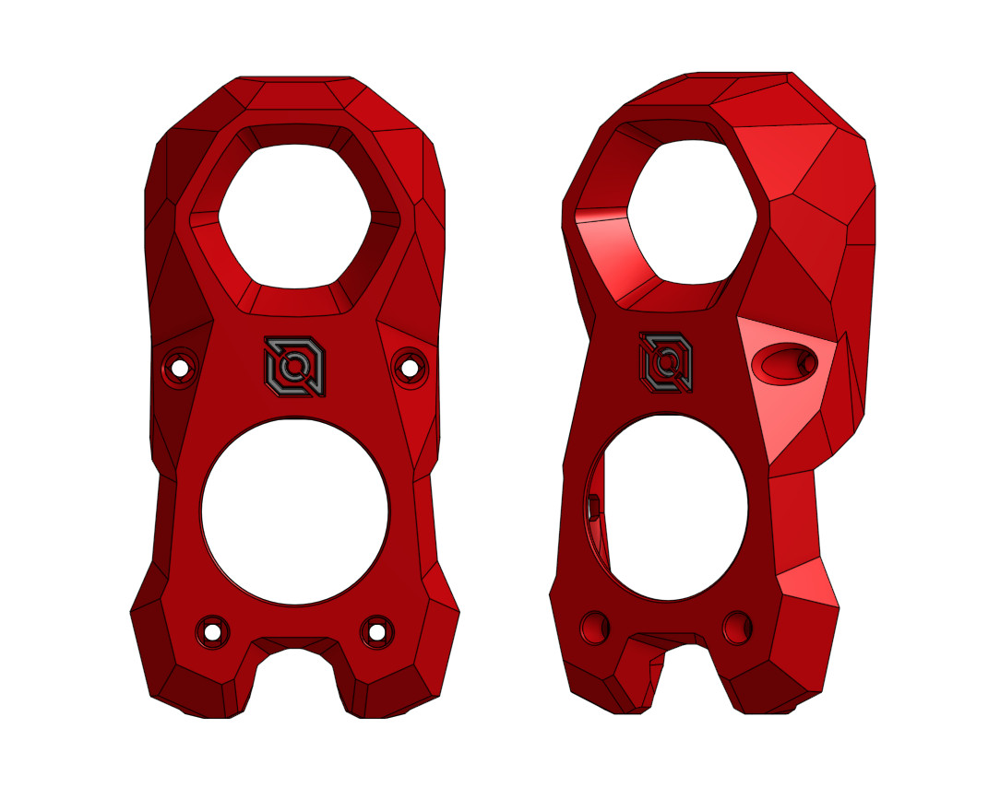
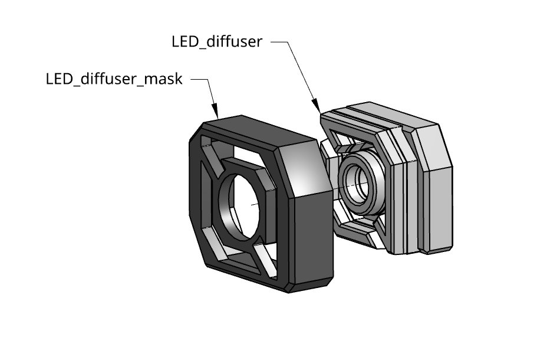
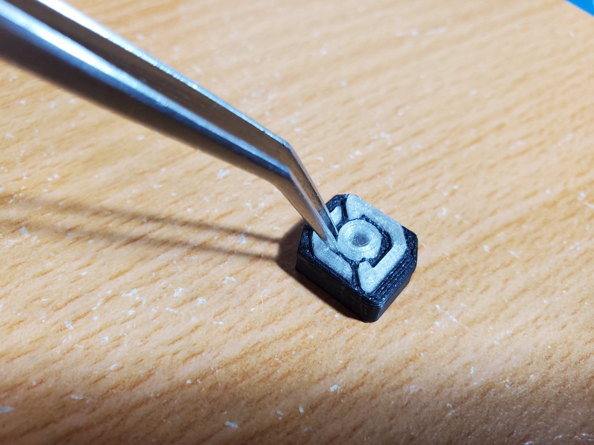
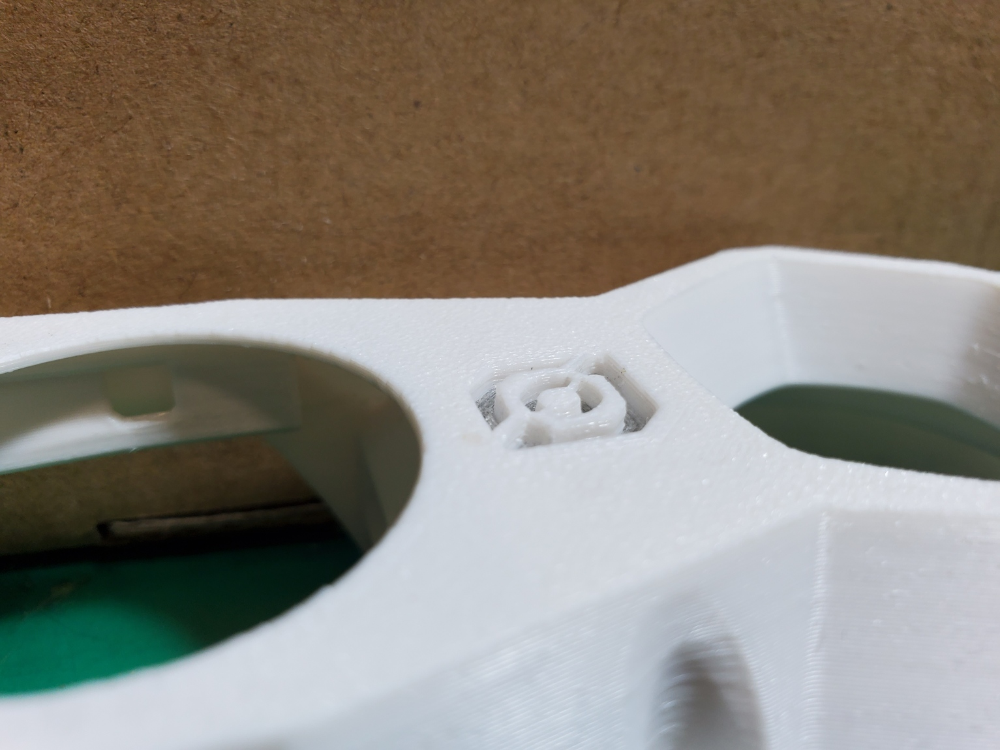
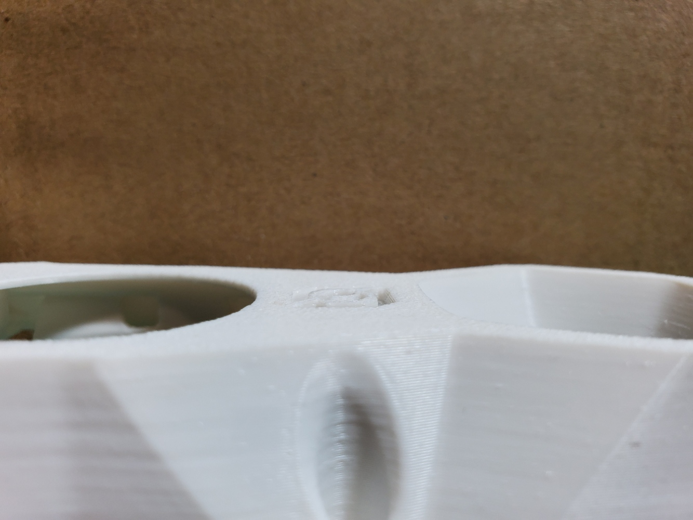
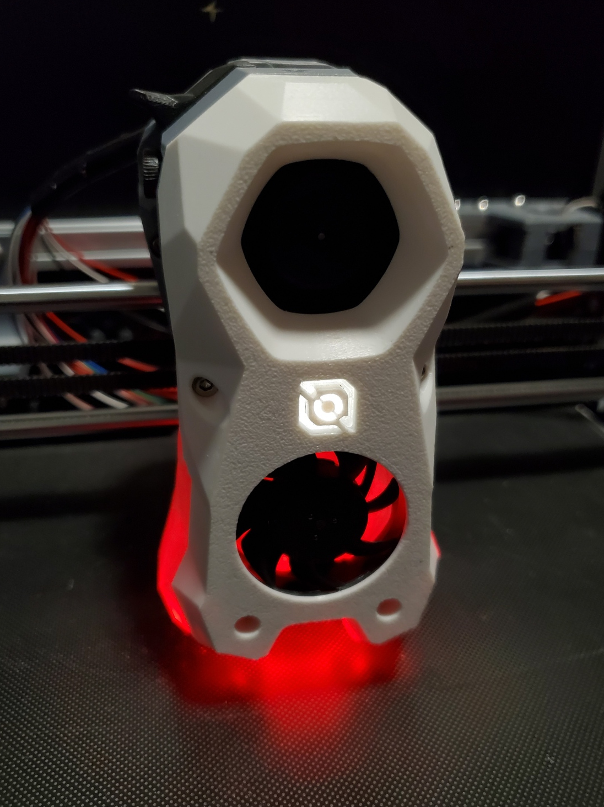
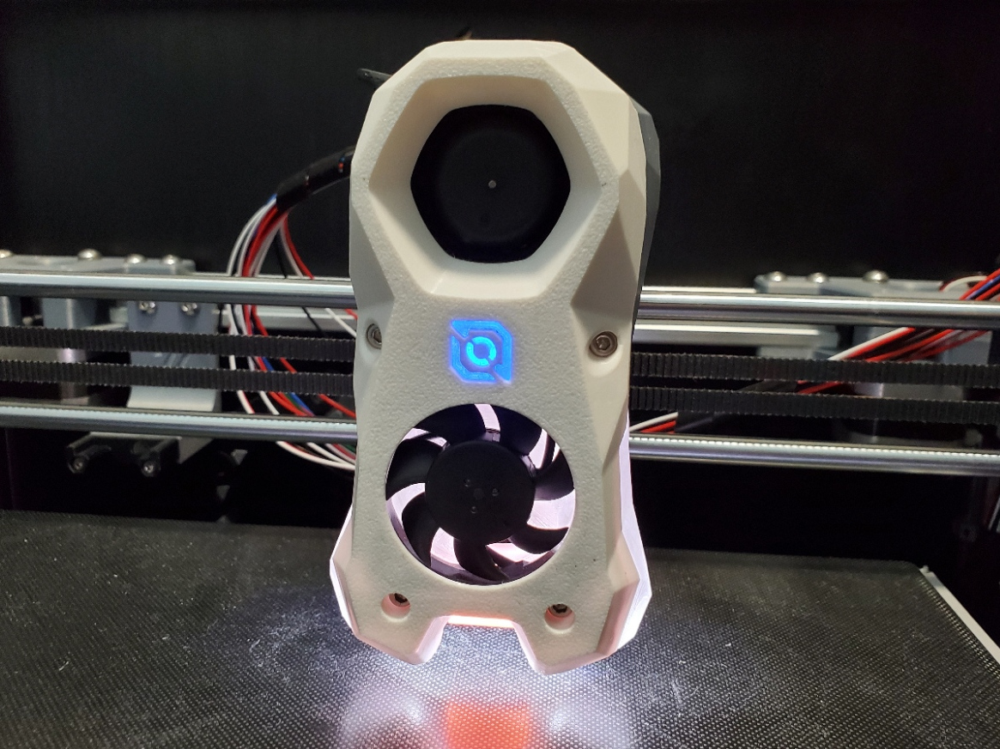

# Voron Stealthburner with LDO motors Logo

This is a mod of the [Voron StealthBurner](https://github.com/VoronDesign/Voron-Stealthburner) mainbody to have the [LDO motors](http://ldomotors.com/) logo LED.

## Printed Parts

Only the modified parts are provided. They are based on the **RC1** release of Stealthburner.

You should get the other parts from the official [Voron StealthBurner](https://github.com/VoronDesign/Voron-Stealthburner) repository.

The file naming and print settings follow Voron's convention (Check the manual of Stealthburner).

## Assembly

The assembly is the same as stock Voron Stealthburner.

Assemble the LED diffuser and its mask. Then insert it into the Stealthburner mainbody.

There are some thin parts so try to clean up all the oozing and seams so they can fit well.

You can use a tweezer to press the thin parts of the mask to fit into the diffuser.

**Make sure the front side of the logo is flat after fully inserting the diffuser.**

There is little clearance between the cutout of mainbody and the LED diffuser, so it might need some force and adjustment.
If the diffuser still cannot fit, try scraping down the walls of the diffuser with a utility knife or re-print it at a lower extrusion multiplier.

## Photos

Short demo video:

## Changelog

### 2022-10-11

- Initial release
